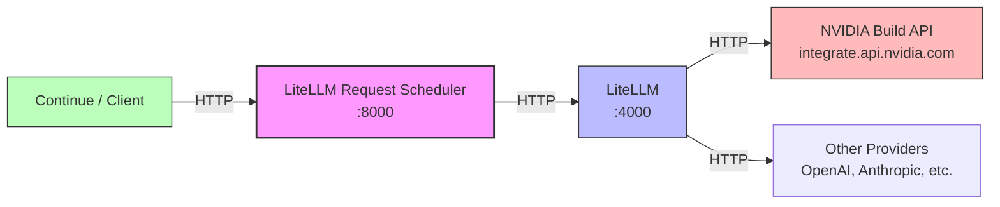
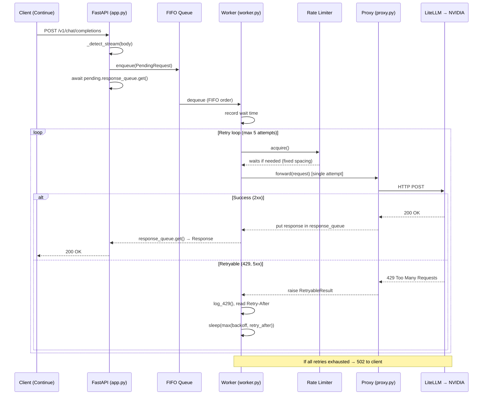
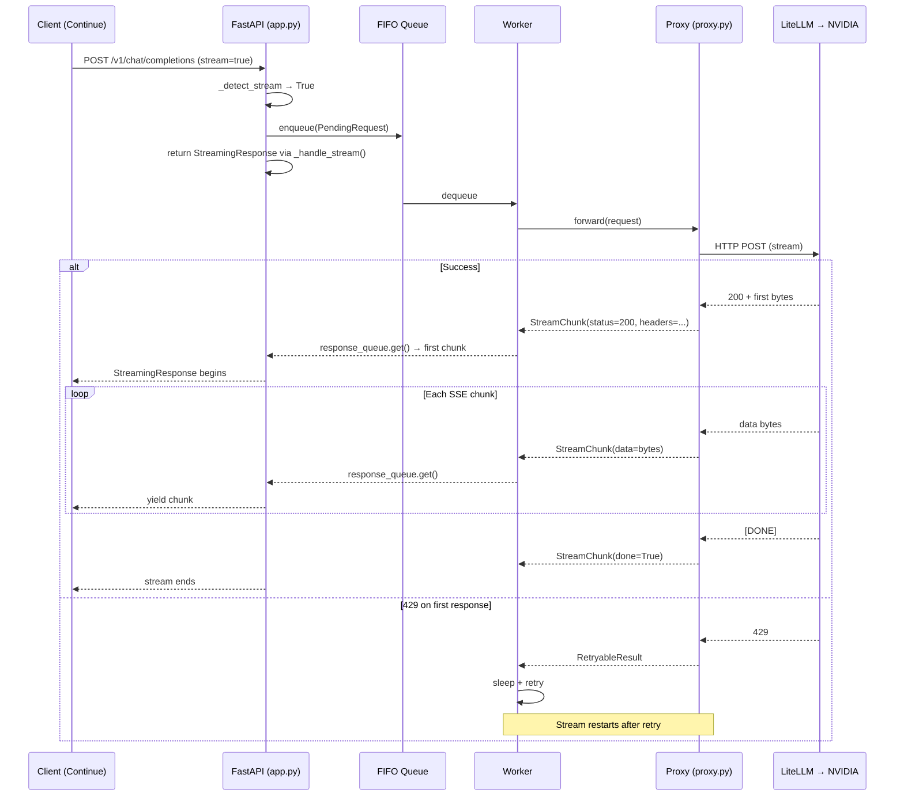

<div align="center">

# LiteLLM Request Scheduler

**A FIFO queue proxy with fixed-rate spacing for LiteLLM and NVIDIA Build API**

[](https://www.python.org/downloads/)
[](LICENSE)
[](https://fastapi.tiangolo.com/)
[](#)

```
Continue ──▶ Request Scheduler (:8000) ──▶ LiteLLM (:4000) ──▶ NVIDIA Build API
```

</div>

---

## Table of Contents

- [What Is This](#what-is-this)
- [Why It Exists](#why-it-exists)
- [The Problem](#the-problem)
- [Use Cases](#use-cases)
- [Architecture](#architecture)
- [Request Flow — Complete Walkthrough](#request-flow--complete-walkthrough)
- [The FIFO Queue](#the-fifo-queue)
- [The Worker](#the-worker)
- [The Rate Limiter](#the-rate-limiter)
- [Retries](#retries)
- [Streaming (SSE)](#streaming-sse)
- [Internal Modules](#internal-modules)
- [Configuration Reference](#configuration-reference)
- [Installation](#installation)
- [Running](#running)
- [Usage](#usage)
- [Compatibility](#compatibility)
- [Logging](#logging)
- [Health Endpoint](#health-endpoint)
- [Metrics Endpoint](#metrics-endpoint)
- [Performance](#performance)
- [Limitations](#limitations)
- [Roadmap](#roadmap)
- [Development](#development)
- [Project Structure](#project-structure)
- [FAQ](#faq)
- [Contributing](#contributing)
- [License](#license)

---

## What Is This

LiteLLM Request Scheduler is an **async HTTP middleware** that sits between your AI coding assistant (Continue, Cursor, or any OpenAI-compatible client) and your LLM backend (LiteLLM → NVIDIA Build API). Its sole purpose is to **prevent 429 rate-limit errors** by serializing all outbound API requests through a single FIFO queue with precise fixed-rate spacing.

It is **not** a load balancer, a cache, or a full API gateway. It does one thing: take your requests, hold them in a queue, and send them to the backend one at a time at exactly the rate the backend allows.

### Key characteristics

| Feature | Detail |
|---|---|
| Single worker | All requests are processed serially — zero concurrency toward the backend |
| Fixed-rate spacing | Enforces exact minimum intervals between requests (no bursts, no token accumulation) |
| Retry-After respect | Reads the `Retry-After` header from the backend and waits at least that long |
| Per-request isolation | Each request owns its own `response_queue` — results are never mixed |
| Streaming support | Full SSE pass-through with chunk-level forwarding |
| Structured logging | JSON logs with 429 origin detection (NVIDIA vs LiteLLM) |
| Zero dependencies on external infrastructure | Pure asyncio — no Redis, no Celery, no message broker |

---

## Why It Exists

### The NVIDIA Build API rate limit problem

The NVIDIA Build API enforces a **sliding-window RPM (requests per minute) limit**. Unlike a simple token-bucket that allows bursts, NVIDIA's sliding window is strict:

- If you send 40 requests in 1 minute and the limit is 35, you get 429'd.
- The window slides — it's not a fixed bucket that resets every 60 seconds.
- Bursty traffic (e.g., 10 requests in 1 second, then idle) will still trigger 429s even if the total count is under the limit, because the window catches the burst.

### Why LiteLLM alone is not enough

[LiteLLM](https://github.com/BerriAI/litellm) is a powerful proxy that unifies 100+ LLM APIs behind an OpenAI-compatible interface. It handles routing, model mapping, and many other concerns. However:

1. **LiteLLM does not serialize requests** — it forwards them as they arrive. If your client sends 5 concurrent requests, LiteLLM sends 5 concurrent requests to NVIDIA.
2. **LiteLLM's built-in rate limiting uses a token-bucket approach** — tokens accumulate during idle periods, allowing bursts that violate NVIDIA's sliding-window rules.
3. **LiteLLM does not read `Retry-After` headers** — when NVIDIA says "wait 1 second", LiteLLM retries immediately or uses its own backoff.
4. **LiteLLM does not log 429 origin** — when you see a 429, you don't know if it came from NVIDIA or from LiteLLM's own limits.

### The solution

LiteLLM Request Scheduler sits **in front of** LiteLLM. It catches every `/v1/*` request, queues it, and forwards it to LiteLLM at a controlled rate. The result:

- **Zero 429 errors from rate limiting** (the proxy enforces spacing)
- **Automatic retries** when 429s still occur (e.g., from NVIDIA's internal limits)
- **Retry-After compliance** (the proxy waits exactly as long as the backend requests)
- **Full visibility** into where 429s originate

```
┌──────────────────────────────────────────────────────────┐
│                    Without LiteLLM Request Scheduler                    │
│                                                          │
│  Continue ──┬──▶ LiteLLM ──▶ NVIDIA ──▶ 429 ✗           │
│             ├──▶ LiteLLM ──▶ NVIDIA ──▶ 200 ✓            │
│             ├──▶ LiteLLM ──▶ NVIDIA ──▶ 429 ✗            │
│             └──▶ LiteLLM ──▶ NVIDIA ──▶ 429 ✗            │
│                                                          │
│  Problem: concurrent burst violates sliding window       │
└──────────────────────────────────────────────────────────┘

┌──────────────────────────────────────────────────────────┐
│                    With LiteLLM Request Scheduler                       │
│                                                          │
│  Continue ──┬──▶ LiteLLM Request Scheduler ──▶ LiteLLM ──▶ NVIDIA ──▶ 200 ✓ │
│             │    (FIFO queue,                          │ │
│             │     1.71s spacing)                         │
│             │                                             │
│  Results arrive sequentially — zero 429s                  │
└──────────────────────────────────────────────────────────┘
```

---

## Use Cases

| Scenario | How LiteLLM Request Scheduler helps |
|---|---|
| **Continue + NVIDIA Build API** | Serializes concurrent autocomplete/chat requests to stay under NVIDIA's sliding-window RPM |
| **Any OpenAI-compatible client + LiteLLM** | Adds a rate-controlled layer between any client and LiteLLM |
| **Cost control** | Prevents runaway request volume by queuing instead of parallel-firing |
| **Development/testing** | Simulates production rate limits locally for testing client resilience |
| **Multi-model routing via LiteLLM** | LiteLLM Request Scheduler is model-agnostic — it queues at the `/v1/*` level, LiteLLM handles routing |
| **CI/CD pipelines** | Prevents CI jobs from overwhelming LLM APIs with concurrent test requests |

---

## Architecture

### High-level topology



### Internal architecture

```mermaid
graph TB
    subgraph "LiteLLM Request Scheduler (port 8000)"
        A[FastAPI App<br/>app.py] -->|enqueue| Q[FIFO Queue<br/>asyncio.Queue]
        Q -->|dequeue| W[Worker<br/>worker.py]
        W -->|acquire| L[FixedRateLimiter<br/>limiter.py]
        W -->|forward (1 attempt)| P[LiteLLMProxy<br/>proxy.py]
        W -->|record| M[Metrics<br/>metrics.py]
        P -->|HTTP| B[LiteLLM Backend]

        W -->|RetryableResult| W
        W -->|response_queue.put| A
    end

    subgraph "Configuration"
        CFG[config.yaml] -->|load| APP[AppConfig<br/>config.py]
    end

    subgraph "Observability"
        LOG[logging_config.py] -->|JSON stdout| S[Structured Logs]
    end

    style A fill:#e1f5fe
    style W fill:#fff3e0
    style L fill:#fce4ec
    style P fill:#e8f5e9
    style Q fill:#f3e5f5
```

### Request lifecycle (Mermaid sequence diagram)



### Streaming request lifecycle



---

## Request Flow — Complete Walkthrough

### Normal (non-streaming) request

Here is exactly what happens, step by step, from the moment you type a message in Continue until you receive a response.

**Step 1 — Client sends request**

Continue sends a standard OpenAI-compatible HTTP request:

```
POST http://localhost:8000/v1/chat/completions
Content-Type: application/json

{
  "model": "deepseek-ai/deepseek-r1",
  "messages": [{"role": "user", "content": "Hello"}],
  "stream": false
}
```

**Step 2 — FastAPI receives and wraps**

`app.py` catches the request in the `/v1/{path:path}` catch-all route. It:

1. Reads the full request body.
2. Calls `_detect_stream(body)` — parses JSON, checks `"stream": true`. In this case, returns `False`.
3. Creates a `PendingRequest` dataclass with a unique 12-character ID (e.g., `a1b2c3d4e5f6`), the method, path, headers, body, query params, and a fresh `asyncio.Queue` for the response.
4. Calls `await _worker.enqueue(pending)`.

**Step 3 — Enqueue**

`worker.py` puts the `PendingRequest` into the FIFO `asyncio.Queue`. This is a non-blocking `await self._queue.put(request)`. A log entry is emitted:

```json
{"level": "INFO", "message": "[a1b2c3d4e5f6] Enqueued | queue=1 method=POST path=/v1/chat/completions stream=false"}
```

**Step 4 — Client waits**

Back in `app.py`, after enqueuing, the handler calls `await _handle_normal(pending)`. This blocks on `pending.response_queue.get()` — a per-request queue that only this client waits on. The HTTP connection stays open.

**Step 5 — Worker dequeues**

The single worker task (`_loop`) calls `await self._queue.get()` and gets the `PendingRequest`. It records the wait time (time between `enqueue_time` and now):

```json
{"level": "INFO", "message": "[a1b2c3d4e5f6] Dequeued | wait=0.05s queue=0"}
```

**Step 6 — Rate limiter**

Before sending anything to the backend, the worker calls `await self._limiter.acquire()`. The `FixedRateLimiter` checks if at least `min_interval` seconds have passed since the last request. If not, it sleeps for the remaining time. With `requests_per_minute=35`, `min_interval=1.714s`.

**Step 7 — Forward to backend**

The worker calls `await self._proxy.forward(request)`. `proxy.py` makes a **single** HTTP request to LiteLLM:

```
POST http://localhost:4000/v1/chat/completions
```

LiteLLM forwards to NVIDIA Build API.

**Step 8 — Response arrives**

If the backend returns `200 OK`:

1. `proxy.py` wraps the response into a `StreamChunk(status_code=200, headers=..., data=..., done=True)`.
2. It puts the chunk into `pending.response_queue`.
3. The worker logs success:

```json
{"level": "INFO", "message": "[a1b2c3d4e5f6] Completed | attempt=1 processing=1.23s rpm=5"}
```

**Step 9 — Client receives response**

Back in `app.py`, `_handle_normal` gets the chunk from `pending.response_queue`, constructs a `Response(data, status_code, headers)`, and returns it to Continue.

**Total flow: 9 steps, 1 HTTP request to backend, 0 429 errors.**

---

## The FIFO Queue

### Why it exists

Without a queue, if 5 requests arrive simultaneously, the worker would need to process them concurrently — meaning 5 parallel HTTP requests to the backend. This defeats the purpose of rate limiting.

### How it works

```
Request 1 ──▶ ┌──────┐
Request 2 ──▶ │ FIFO │ ──▶ Worker processes Request 1 first
Request 3 ──▶ │Queue │       then Request 2
Request 4 ──▶ └──────┘       then Request 3
Request 5 ──▶                then Request 4
                             then Request 5
```

- The queue is a standard `asyncio.Queue` with optional `max_size` (0 = unlimited).
- `enqueue()` is called by the FastAPI handler (one per incoming request).
- `dequeue()` is called by the single worker loop (one at a time).
- FIFO order is guaranteed — requests are processed in the exact order they arrived.

### What it guarantees

| Guarantee | Mechanism |
|---|---|
| **Order preservation** | `asyncio.Queue` is FIFO by definition |
| **No concurrency** | Single worker task dequeues one at a time |
| **No dropped requests** | Queue is unbounded by default (`max_size=0`) |
| **No mixed responses** | Each `PendingRequest` has its own `response_queue` |
| **Backpressure** | If `max_size` is set, `enqueue()` blocks when full |

### What problems it avoids

1. **Race conditions** — No concurrent access to the backend. One request = one HTTP call.
2. **Token bucket bursts** — Requests are serialized, so burst is impossible.
3. **NVIDIA 429s** — Controlled spacing prevents sliding-window violations.
4. **Response mixing** — Per-request `response_queue` ensures each client gets its own response.

---

## The Worker

### Why there is exactly one

The worker is a single `asyncio.Task` running an infinite loop. It processes one request at a time, fully completing it (including retries) before moving to the next.

```python
async def _loop(self) -> None:
    while self._running:
        request = await self._queue.get()
        await self._process(request)  # blocks until done
```

**Why not multiple workers?** Because the goal is to **serialize** requests to the backend. Two workers would mean two concurrent HTTP requests, which defeats the rate limiter.

### Processing pipeline

For each request, the worker executes:

```
┌─────────────────────────────────────────────────┐
│ 1. Dequeue from FIFO                            │
│ 2. Record wait time                             │
│ 3. Check if cancelled → skip if yes             │
│ 4. Retry loop (max N attempts):                 │
│    a. Check if cancelled → skip if yes          │
│    b. Rate limiter: acquire()                   │
│    c. Check if cancelled → skip if yes          │
│    d. Forward (single HTTP attempt)             │
│    e. On success → record metrics, return       │
│    f. On RetryableResult:                       │
│       - Log (429 gets special structured log)   │
│       - If last attempt → break                 │
│       - Calculate delay (max of backoff,        │
│         Retry-After)                            │
│       - Sleep(delay)                            │
│       - Loop back to step 4a                    │
│ 5. If exhausted → emit 502 error                │
└─────────────────────────────────────────────────┘
```

### Cancellation support

The worker checks `request.cancelled.is_set()` at three points:

1. Before the retry loop starts
2. Before each attempt (after dequeuing, before rate limiter)
3. During rate limiter wait

If the client disconnects (e.g., user closes Continue), the `CancelledError` propagates and sets the `cancelled` event. The worker stops processing and moves to the next request.

---

## The Rate Limiter

### Algorithm: Fixed Spacing

The rate limiter uses a **fixed-spacing** algorithm, not a token bucket. This is the critical design decision that prevents 429 errors with NVIDIA's sliding-window rate limits.

### How it works

```
min_interval = 60 / requests_per_minute

With requests_per_minute = 35:
  min_interval = 60 / 35 = 1.714 seconds

Timeline:
  t=0.000s  → Request 1 sent immediately
  t=1.714s  → Request 2 sent (waited 1.714s)
  t=3.428s  → Request 3 sent (waited 1.714s)
  t=5.142s  → Request 4 sent (waited 1.714s)
  ...
```

### Pseudocode

```
class FixedRateLimiter:
    min_interval = 60.0 / requests_per_minute
    last_request_time = 0  # epoch

    async def acquire():
        now = monotonic()
        elapsed = now - last_request_time

        if elapsed < min_interval:
            wait = min_interval - elapsed
            await sleep(wait)

        last_request_time = monotonic()
```

### Why fixed-spacing over token bucket

| Aspect | Token Bucket | Fixed Spacing |
|---|---|---|
| **Burst behavior** | Allows bursts up to `burst` tokens | No bursts — strict spacing |
| **Idle accumulation** | Tokens accumulate when idle | No accumulation |
| **NVIDIA compatibility** | Risky — sliding window catches bursts | Safe — spacing never violates window |
| **Throughput** | Higher during bursts | Consistent, predictable |
| **Complexity** | Higher (tokens, refill rate) | Lower (single timestamp) |
| **Memory** | Token counter | Single float |

**The key insight**: NVIDIA's sliding-window rate limit penalizes bursts even if the total count is under the limit. Token bucket allows bursts. Fixed spacing does not.

### Properties

| Property | Description |
|---|---|
| `min_interval` | Seconds between requests (e.g., 1.714 at 35 RPM) |
| `effective_rpm` | Requests sent in the current 60s window (diagnostic) |
| `total_requests` | Total requests that have passed through the limiter |
| `seconds_until_next` | Seconds until the next request can be sent |

### Advantages and disadvantages

**Advantages:**
- Guaranteed to never exceed the RPM limit
- Simple to understand and debug
- Deterministic behavior
- Perfect match for sliding-window rate limits

**Disadvantages:**
- Lower throughput than token bucket during burst-friendly windows
- Cannot take advantage of idle periods to build up "credits"
- Fixed — does not adapt to changing backend limits

---

## Retries

### Which HTTP codes trigger retries

| Status Code | Meaning | Retryable? |
|---|---|---|
| `429` | Too Many Requests | Yes |
| `500` | Internal Server Error | Yes |
| `502` | Bad Gateway | Yes |
| `503` | Service Unavailable | Yes |
| `504` | Gateway Timeout | Yes |
| Transport errors | Connection refused, timeout, etc. | Yes (status=0) |
| `400`, `401`, `403`, `404` | Client errors | No |
| `200` | Success | N/A |

### Why these codes

- **429**: The backend explicitly says "slow down". Always retry after waiting.
- **5xx**: Server-side transient errors that may resolve on retry.
- **Transport errors**: Network-level failures (connection refused, timeout) that are inherently transient.
- **4xx (except 429)**: Client errors that will not resolve by retrying with the same request.

### Backoff algorithm

```python
# Linear backoff (exponential=false)
delay = initial_delay  # e.g., 2.0 seconds

# Exponential backoff (exponential=true)
delay = initial_delay * (2 ** attempt)
# attempt 0: 2.0s
# attempt 1: 4.0s
# attempt 2: 8.0s
# attempt 3: 16.0s

# Capped at max_delay
delay = min(delay, max_delay)  # e.g., 30 seconds
```

### Retry-After compliance

When the backend sends a `Retry-After` header, the worker uses:

```
delay = max(config_backoff, retry_after)
```

This means:
- If the backend says "wait 5 seconds" and the config backoff is 2 seconds → waits 5 seconds.
- If the backend says "wait 0.5 seconds" and the config backoff is 2 seconds → waits 2 seconds.
- The proxy never waits **less** than the backend requests.

### When retries stop

Retries stop when:
1. The request succeeds (2xx response).
2. The maximum number of attempts is reached (default: 5).
3. The client disconnects (`cancelled` event is set).

When all retries are exhausted, the worker returns a `502 Bad Gateway` with a JSON body:

```json
{
  "error": {
    "message": "All retry attempts exhausted",
    "type": "proxy_error",
    "last_status": 429,
    "detail": "{\"error\":{\"message\":\"rate limited by NVIDIA\"}}"
  }
}
```

---

## Streaming (SSE)

### How streaming works

When the client sends `"stream": true` in the request body, the proxy switches to streaming mode. The flow changes significantly from non-streaming.

### The streaming protocol

```
Client ◄──StreamingResponse── Worker ◄──stream── Proxy ◄──stream── Backend
```

**Step 1**: Client sends request with `"stream": true`.

**Step 2**: `app.py` detects streaming via `_detect_stream()`.

**Step 3**: The request enters the queue and eventually reaches the worker.

**Step 4**: The worker calls `proxy.forward()`, which uses `httpx.AsyncClient.stream()` to open a streaming connection to the backend.

**Step 5**: The first thing the proxy puts into `response_queue` is a `StreamChunk` with `status_code` and `headers` but **no data**. This signals to the client handler that the backend accepted the request.

**Step 6**: Subsequent `StreamChunk` objects carry `data` (raw bytes from the SSE stream).

**Step 7**: When the backend finishes, the proxy puts `StreamChunk(done=True)` as a sentinel.

**Step 8**: The client handler in `app.py` reads chunks from the `response_queue` and yields them via `StreamingResponse`.

### Per-request response isolation

Each `PendingRequest` creates its own `asyncio.Queue`:

```python
@dataclass
class PendingRequest:
    response_queue: asyncio.Queue[StreamChunk] = field(
        default_factory=asyncio.Queue
    )
```

This means:
- Client A's response never mixes with Client B's response.
- Each client awaits on its own queue.
- The worker puts chunks into the correct queue based on the request it's processing.

### What happens with `stream=false` vs `stream=true`

| Aspect | `stream=false` | `stream=true` |
|---|---|---|
| Backend connection | Standard HTTP request | Streaming HTTP request |
| Response chunks | 1 chunk (full body) | Multiple chunks (SSE events) |
| First chunk | Contains status + headers + data | Contains status + headers only |
| Sentinel | `done=True` on the single chunk | `done=True` after all data chunks |
| Client handler | `_handle_normal()` | `_handle_stream()` |
| Content-Type | `application/json` (or backend's) | `text/event-stream` |

### Client disconnection during streaming

If the client disconnects mid-stream (e.g., user closes Continue):

1. The `StreamingResponse` generator raises `asyncio.CancelledError`.
2. The generator catches it and sets `pending.cancelled.set()`.
3. On the next iteration, the proxy sees `cancelled.is_set()` and stops reading from the backend.
4. The worker, on its next retry loop check, sees the cancelled flag and stops.

---

## Internal Modules

### `app.py` — FastAPI application

**Responsibility:**
- HTTP interface to the outside world.
- Detects streaming requests from JSON body.
- Creates `PendingRequest` objects and enqueues them.
- Returns responses to clients (both streaming and non-streaming).
- Serves `/health` and `/metrics` endpoints.

**What it never does:**
- Never communicates with the backend directly.
- Never makes retry decisions.
- Never rate-limits.
- Never reads response body beyond what the worker puts in `response_queue`.

**Key functions:**

| Function | Purpose |
|---|---|
| `_detect_stream(body)` | Parses JSON, returns `True` if `"stream": true` |
| `_handle_stream(pending)` | Returns a `StreamingResponse` fed by `response_queue` |
| `_handle_normal(pending)` | Returns a full `Response` from `response_queue` |
| `_filter_resp_headers(headers)` | Strips hop-by-hop headers (transfer-encoding, etc.) |
| `proxy_endpoint(request, path)` | Catch-all `/v1/{path}` handler |

---

### `worker.py` — Single async worker

**Responsibility:**
- Dequeues requests from the FIFO queue one at a time.
- Runs the retry loop for each request.
- Calls the rate limiter before every backend attempt.
- Handles `RetryableResult` exceptions from the proxy.
- Logs structured 429 diagnostics.
- Emits final 502 errors when retries are exhausted.

**What it never does:**
- Never creates HTTP connections itself (delegates to `proxy.py`).
- Never makes policy decisions about which endpoints to queue (all `/v1/*` are queued).
- Never reads or modifies the request body.

**Key methods:**

| Method | Purpose |
|---|---|
| `_loop()` | Main event loop: dequeue → process |
| `_process(request)` | Per-request pipeline: rate-limit → forward → retry |
| `_get_delay(attempt)` | Calculates backoff delay for retry N |
| `_log_429(...)` | Structured 429 diagnostic logging |
| `_emit_exhausted(...)` | Logs and returns 502 after all retries fail |

---

### `proxy.py` — HTTP forwarding client

**Responsibility:**
- Makes exactly **one** HTTP attempt per `forward()` call.
- Routes to either `_forward_normal` or `_forward_stream` based on request type.
- Parses response status, headers, body, and `Retry-After`.
- Raises `RetryableResult` on retryable failures.
- Detects 429 origin (NVIDIA vs LiteLLM vs unknown) from response body.

**What it never does:**
- Never retries. A single `forward()` = a single HTTP call.
- Never rate-limits (the worker handles that).
- Never manages the queue.

**Key classes:**

| Class/Function | Purpose |
|---|---|
| `RetryableResult` | Exception carrying retry context (status, headers, body, retry_after, origin) |
| `LiteLLMProxy` | HTTP client wrapping `httpx.AsyncClient` |
| `_parse_retry_after(headers)` | Extracts `Retry-After` header value in seconds |

**`RetryableResult.origin` detection logic:**

```
if body contains "nvidia" or "nim" → "nvidia"
if body contains "litellm"         → "litellm"
if body contains "integrate.api.nvidia" → "nvidia"
otherwise                           → "unknown"
```

---

### `limiter.py` — Fixed-rate spacing limiter

**Responsibility:**
- Enforces minimum time between consecutive backend requests.
- Tracks request counts and sliding windows for diagnostics.

**What it never does:**
- Never decides whether to retry (the worker handles that).
- Never rejects requests (it only delays them).
- Never communicates with the backend.

---

### `metrics.py` — Performance metrics

**Responsibility:**
- Tracks processed/failed request counts.
- Records sliding-window RPM.
- Records wait times (time in queue) and processing times (time with backend).
- Exports all metrics as a JSON-serializable dictionary.

**What it never does:**
- Never modifies request flow.
- Never persists data to disk.
- Never exposes metrics directly (the app handles HTTP endpoints).

**Memory management:** Uses `deque(maxlen=1000)` for wait and processing time samples. Old samples are automatically evicted, keeping memory constant regardless of uptime.

---

### `config.py` — Configuration management

**Responsibility:**
- Defines Pydantic models for all configuration sections.
- Loads `config.yaml` with fallback to defaults.
- Validates configuration at startup.

**What it never does:**
- Never reads environment variables (config.yaml only).
- Never modifies configuration at runtime.

---

### `models.py` — Data models

**Responsibility:**
- Defines `StreamChunk` (response data carrier).
- Defines `PendingRequest` (queue item with metadata).

**What it never does:**
- Never contains business logic.
- Never modifies data.

---

### `logging_config.py` — Structured logging

**Responsibility:**
- Configures JSON-formatted logging to stdout.
- Silences noisy third-party loggers (httpx, httpcore, uvicorn.access).

**What it never does:**
- Never writes to files.
- Never modifies log records from other modules.

---

## Configuration Reference

The proxy is configured via `config.yaml`. All fields are optional — sensible defaults are provided.

### Complete example

```yaml
proxy:
  host: 0.0.0.0
  port: 8000

litellm:
  url: http://localhost:4000

rate_limit:
  algorithm: fixed_spacing
  requests_per_minute: 35
  burst: 1

retry:
  attempts: 5
  initial_delay: 2
  max_delay: 30
  exponential: true

queue:
  max_size: 0

logging:
  level: INFO
```

### Line-by-line reference

#### `proxy`

| Key | Type | Default | Description |
|---|---|---|---|
| `host` | `string` | `0.0.0.0` | Interface to bind. Use `127.0.0.1` for local-only. |
| `port` | `integer` | `8000` | Port the proxy listens on. |

#### `litellm`

| Key | Type | Default | Description |
|---|---|---|---|
| `url` | `string` | `http://localhost:4000` | Base URL of the LiteLLM server. All `/v1/*` requests are forwarded here. |

#### `rate_limit`

| Key | Type | Default | Description |
|---|---|---|---|
| `algorithm` | `string` | `fixed_spacing` | Rate limiting algorithm. Currently only `fixed_spacing` is implemented. |
| `requests_per_minute` | `integer` | `35` | Maximum requests per minute. The limiter enforces `60/RPM` seconds between requests. |
| `burst` | `integer` | `1` | **Unused.** Kept for backward compatibility. Fixed-spacing does not allow bursts. |

#### `retry`

| Key | Type | Default | Description |
|---|---|---|---|
| `attempts` | `integer` | `5` | Maximum number of attempts per request (including the first). |
| `initial_delay` | `float` | `2.0` | Base delay in seconds for the first retry. |
| `max_delay` | `float` | `30.0` | Maximum delay in seconds (caps exponential backoff). |
| `exponential` | `bool` | `true` | `true` = exponential backoff (`initial * 2^attempt`). `false` = constant delay. |

#### `queue`

| Key | Type | Default | Description |
|---|---|---|---|
| `max_size` | `integer` | `0` | Maximum queue depth. `0` = unlimited. When full, `enqueue()` blocks until space is available. |

#### `logging`

| Key | Type | Default | Description |
|---|---|---|---|
| `level` | `string` | `INFO` | Minimum log level. Options: `DEBUG`, `INFO`, `WARNING`, `ERROR`, `CRITICAL`. |

---

## Installation

### Prerequisites

- Python 3.10 or higher
- pip
- LiteLLM running and accessible (typically on port 4000)
- NVIDIA Build API key (configured in LiteLLM)

### Step-by-step

```bash
# 1. Clone or download the project
git clone https://github.com/youruser/queue-proxy.git
cd queue-proxy

# 2. Create a virtual environment
python3 -m venv .venv

# 3. Activate the virtual environment
# On bash/zsh:
source .venv/bin/activate
# On fish:
.venv/bin/activate.fish
# Or just use .venv/bin/python directly

# 4. Install dependencies
pip install -r requirements.txt

# 5. (Optional) Edit configuration
#    Modify config.yaml to match your setup
```

### Dependencies

| Package | Version | Purpose |
|---|---|---|
| `fastapi` | >= 0.115.0 | HTTP framework |
| `uvicorn[standard]` | >= 0.34.0 | ASGI server |
| `httpx` | >= 0.28.0 | Async HTTP client for backend forwarding |
| `pydantic` | >= 2.10.0 | Configuration validation |
| `PyYAML` | >= 6.0.0 | YAML config file parsing |

---

## Running

### Start the proxy

```bash
# Direct execution (recommended)
python app.py

# Or with uvicorn
uvicorn app:app --host 0.0.0.0 --port 8000
```

### Expected output

```json
{"timestamp": "2026-07-23T10:00:00+00:00", "level": "INFO", "logger": "litellm_request_scheduler", "message": "LiteLLM Request Scheduler started | listen=0.0.0.0:8000 | backend=http://localhost:4000 | rpm=35"}
{"timestamp": "2026-07-23T10:00:00+00:00", "level": "INFO", "logger": "proxy", "message": "LiteLLM proxy client started -> http://localhost:4000"}
{"timestamp": "2026-07-23T10:00:00+00:00", "level": "INFO", "logger": "worker", "message": "Worker started"}
```

### Verify it's running

```bash
curl http://localhost:8000/health
```

```json
{
  "status": "ok",
  "queue_size": 0,
  "processing": false,
  "processed_requests": 0,
  "average_wait_seconds": 0.0,
  "uptime": "0m 5s"
}
```

---

## Usage

### Pointing Continue to the proxy

In your Continue configuration (`~/.continue/config.yaml`), change the API base URL:

```yaml
models:
  - title: "DeepSeek R1"
    provider: openai
    model: deepseek-ai/deepseek-r1
    apiBase: http://localhost:8000/v1    # ← LiteLLM Request Scheduler, not LiteLLM directly
```

### Pointing other clients

Any OpenAI-compatible client can use the proxy. Just change the base URL:

```bash
# Instead of:
curl http://localhost:4000/v1/chat/completions ...

# Use:
curl http://localhost:8000/v1/chat/completions ...
```

### Example: chat completion

```bash
curl -X POST http://localhost:8000/v1/chat/completions \
  -H "Content-Type: application/json" \
  -d '{
    "model": "deepseek-ai/deepseek-r1",
    "messages": [{"role": "user", "content": "Hello"}],
    "stream": false
  }'
```

### Example: streaming

```bash
curl -X POST http://localhost:8000/v1/chat/completions \
  -H "Content-Type: application/json" \
  -d '{
    "model": "deepseek-ai/deepseek-r1",
    "messages": [{"role": "user", "content": "Hello"}],
    "stream": true
  }'
```

### Example: list models

```bash
curl http://localhost:8000/v1/models
```

### All supported endpoints

Every `/v1/*` endpoint is proxied. Common ones include:

| Endpoint | Method | Purpose |
|---|---|---|
| `/v1/chat/completions` | POST | Chat completions (streaming and non-streaming) |
| `/v1/completions` | POST | Text completions |
| `/v1/embeddings` | POST | Text embeddings |
| `/v1/models` | GET | List available models |
| `/v1/images/generations` | POST | Image generation |
| `/v1/audio/*` | POST | Audio endpoints |
| `/health` | GET | Proxy health check |
| `/metrics` | GET | Proxy performance metrics |

---

## Compatibility

### Verified with

| Component | Version | Notes |
|---|---|---|
| **Continue** | Latest | Primary use case. Change `apiBase` to proxy URL. |
| **LiteLLM** | 1.x | Proxy sits in front of LiteLLM. Any version works. |
| **NVIDIA Build API** | Current | `integrate.api.nvidia.com`. Primary 429 source. |
| **OpenAI API** | Compatible | Any client using OpenAI-compatible endpoints. |
| **Python** | 3.10+ | Uses `asyncio` features from 3.10+. |

### API compatibility

The proxy is **fully transparent** — it forwards all headers, methods, query parameters, and body content. Any OpenAI-compatible client works without modification (except changing the base URL).

---

## Logging

All logs are output as **JSON to stdout**, making them easy to parse with log aggregators (ELK, Datadog, CloudWatch, etc.).

### Log format

```json
{
  "timestamp": "2026-07-23T10:00:00.123456+00:00",
  "level": "INFO",
  "logger": "worker",
  "message": "[a1b2c3d4e5f6] Dequeued | wait=0.05s queue=0"
}
```

### Log events reference

| Event | Level | Example | When |
|---|---|---|---|
| `Enqueued` | INFO | `[a1b2c3d4e5f6] Enqueued \| queue=1 method=POST path=/v1/chat/completions stream=false` | Request enters the queue |
| `Dequeued` | INFO | `[a1b2c3d4e5f6] Dequeued \| wait=0.05s queue=0` | Worker picks up the request |
| `Completed` | INFO | `[a1b2c3d4e5f6] Completed \| attempt=1 processing=1.23s rpm=5` | Request succeeded |
| `Cancelled before processing` | INFO | `[a1b2c3d4e5f6] Cancelled before processing, skipping` | Client disconnected before worker started |
| `Cancelled before attempt` | INFO | `[a1b2c3d4e5f6] Cancelled before attempt 3` | Client disconnected before retry |
| `Cancelled during rate-limit` | INFO | `[a1b2c3d4e5f6] Cancelled during rate-limit, skipping` | Client disconnected during rate limiter wait |
| `Retry-After` | INFO | `[a1b2c3d4e5f6] Retry-After=1.0s config_backoff=2.0s → waiting 2.0s` | Retry-After header received |
| `Backoff` | INFO | `[a1b2c3d4e5f6] Backoff 4.0s (attempt 2/5)` | Exponential backoff before retry |
| `*** HTTP 429 ***` | WARNING | See 429 section below | 429 received from backend |
| `Retryable HTTP` | WARNING | `[a1b2c3d4e5f6] Retryable HTTP 503 on attempt 2/5 ...` | Non-429 retryable error |
| `RETRIES EXHAUSTED` | ERROR | `[a1b2c3d4e5f6] RETRIES EXHAUSTED \| attempts=5 \| last_status=429` | All retries failed |
| `Unexpected worker error` | ERROR | `[a1b2c3d4e5f6] Unexpected worker error: ...` | Unexpected exception |

### 429 structured log

When a 429 is received, the worker emits a detailed diagnostic log:

```
[a1b2c3d4e5f6] *** HTTP 429 *** | attempt=1/5 | endpoint=POST /v1/chat/completions | send_time=1234567.890 | response_time=1234568.123 | latency=0.233s | origin=nvidia | origin_hint=via-litellm (proxy→localhost, likely forwarded from NVIDIA) | retry_after=1.0s | body={"error":{"message":"rate limited by NVIDIA"}} | headers={"retry-after": "1", "x-nvidia-request-id": "req-1"}
```

| Field | Description |
|---|---|
| `attempt` | Current attempt number / max attempts |
| `endpoint` | HTTP method + path |
| `send_time` | Monotonic timestamp when the request was sent |
| `response_time` | Monotonic timestamp when the response arrived |
| `latency` | Round-trip time |
| `origin` | Detected origin: `nvidia`, `litellm`, or `unknown` |
| `origin_hint` | Human-readable hint about where the 429 came from |
| `retry_after` | Value of the `Retry-After` header (or `not set`) |
| `body` | First 500 characters of the response body |
| `headers` | Rate-limit-related headers (`x-ratelimit-*`, `retry-after`, `x-nvidia-*`) |

---

## Health Endpoint

```
GET /health
```

Returns a quick liveness check with queue depth.

### Response

```json
{
  "status": "ok",
  "queue_size": 0,
  "processing": false,
  "processed_requests": 42,
  "average_wait_seconds": 0.127,
  "uptime": "2h 15m"
}
```

### Fields

| Field | Type | Description |
|---|---|---|
| `status` | `string` | Always `"ok"` if the proxy is running |
| `queue_size` | `integer` | Number of requests currently waiting in the queue |
| `processing` | `boolean` | `true` if the worker is actively handling a request |
| `processed_requests` | `integer` | Total requests successfully processed since startup |
| `average_wait_seconds` | `float` | Average time requests spent waiting in the queue |
| `uptime` | `string` | Human-readable uptime |

---

## Metrics Endpoint

```
GET /metrics
```

Returns full performance metrics.

### Response

```json
{
  "status": "ok",
  "uptime": "2h 15m",
  "processed_requests": 42,
  "failed_requests": 2,
  "current_rpm": 12,
  "average_wait_seconds": 0.127,
  "average_processing_seconds": 1.453,
  "queue_size": 0,
  "recent_samples": 42
}
```

### Fields

| Field | Type | Description |
|---|---|---|
| `status` | `string` | Always `"ok"` |
| `uptime` | `string` | Human-readable uptime |
| `processed_requests` | `integer` | Total successful requests |
| `failed_requests` | `integer` | Total failed requests (exhausted retries or unexpected errors) |
| `current_rpm` | `integer` | Effective requests per minute (sliding 60s window) |
| `average_wait_seconds` | `float` | Average queue wait time across recent samples |
| `average_processing_seconds` | `float` | Average backend round-trip time across recent samples |
| `queue_size` | `integer` | Current queue depth |
| `recent_samples` | `integer` | Number of samples in the metrics window (max 1000) |

---

## Performance

### Throughput

With `requests_per_minute=35`:

```
Max throughput = 35 requests/minute = 0.58 requests/second
Time between requests = 1.714 seconds
```

With `requests_per_minute=300` (test configuration):

```
Max throughput = 300 requests/minute = 5 requests/second
Time between requests = 0.2 seconds
```

### Latency characteristics

| Component | Latency |
|---|---|
| Queue wait | Depends on queue depth × min_interval |
| Rate limiter wait | 0 to min_interval seconds |
| Backend round-trip | Depends on model and provider (typically 0.5–30s) |
| Proxy overhead | Negligible (< 1ms per request) |

### Memory usage

- **Queue**: Each `PendingRequest` is ~1KB (body bytes + metadata).
- **Metrics**: Capped at 1000 samples (~8KB).
- **Rate limiter**: Single float timestamp (~8 bytes).
- **Total baseline**: ~5MB resident memory.

Memory usage is constant regardless of uptime or request volume.

### Behavior under load

1. **Low load** (< RPM limit): Requests pass through with minimal delay.
2. **At RPM limit**: Requests queue up and are processed at exactly the rate limit.
3. **Burst traffic**: Requests pile up in the queue. Processing rate stays constant. Clients wait longer.
4. **Backend 429s**: Worker retries with backoff, further slowing throughput temporarily.

---

## Limitations

### What this proxy does NOT do

| Limitation | Explanation |
|---|---|
| **No multi-worker support** | Single worker by design. Adding workers would defeat rate limiting. |
| **No request prioritization** | All requests are FIFO. No way to prioritize certain requests. |
| **No persistence** | Queue is in-memory. Restart loses all queued requests. |
| **No authentication** | The proxy does not verify client identity. Anyone on the network can use it. |
| **No TLS** | Plain HTTP only. Use a reverse proxy (nginx, Caddy) for TLS. |
| **No load balancing** | Single backend only. No health checks or failover. |
| **No caching** | Every request hits the backend. |
| **No request deduplication** | Duplicate requests are queued and processed separately. |
| **No per-client rate limiting** | Rate limit is global. One chatty client can consume all quota. |
| **No request size limits** | Large request bodies are held in memory. |
| **No WebSocket support** | HTTP only. |
| **No gRPC support** | HTTP/REST only. |

### Known constraints

- The `burst` config option is **ignored**. Fixed-spacing does not allow bursts.
- The `algorithm` config option accepts any string but only `fixed_spacing` is implemented.
- Streaming retry: if a 429 arrives after streaming has already started (first chunk sent), the retry mechanism cannot replay the stream. The client receives a truncated response. In practice, 429s almost always arrive before streaming begins.
- `Retry-After` in HTTP-date format is not supported (only integer seconds). NVIDIA uses integer `Retry-After`, so this is fine in practice.

---

## Roadmap

### Short-term

- [ ] **Configurable per-endpoint rate limits** — different RPM for `/v1/chat/completions` vs `/v1/embeddings`
- [ ] **Request body size limit** — configurable max body size to prevent memory exhaustion
- [ ] **Graceful shutdown** — drain the queue before stopping
- [ ] **Docker support** — `Dockerfile` + `docker-compose.yml`

### Medium-term

- [ ] **Multiple workers with sharding** — hash by client IP or model to shard across workers
- [ ] **Priority queues** — allow certain requests (e.g., non-streaming) to be prioritized
- [ ] **Prometheus metrics** — `/metrics` endpoint with Prometheus-compatible format
- [ ] **Request deduplication** — detect and collapse identical in-flight requests
- [ ] **Per-client rate limiting** — separate rate limit buckets per client identity

### Long-term

- [ ] **Redis-backed queue** — optional persistence for restart survival
- [ ] **Kubernetes deployment** — Helm chart with HPA
- [ ] **Web dashboard** — real-time queue visualization and metrics
- [ ] **Dynamic rate limit adjustment** — auto-detect backend limits from 429 headers
- [ ] **Multi-backend support** — route to different LiteLLM instances based on model
- [ ] **TLS termination** — built-in TLS support (or auto-detection of reverse proxy)
- [ ] **Authentication layer** — API key validation before queueing
- [ ] **gRPC proxy support** — extend beyond HTTP/REST
- [ ] **WebSocket proxy support** — for real-time streaming APIs

---

## Development

### Setting up for development

```bash
# Clone and enter the project
cd litellm-request-scheduler

# Create virtual environment
python3 -m venv .venv
source .venv/bin/activate  # or .venv/bin/activate.fish

# Install dependencies
pip install -r requirements.txt

# Run tests
python test_e2e.py
python test_retry.py
```

### Running tests

The project uses end-to-end tests with a mock LiteLLM backend. No test framework required — tests are plain Python scripts.

```bash
# Full integration tests (7 tests)
python test_e2e.py

# Retry behavior tests (4 tests)
python test_retry.py
```

Both tests spin up a mock backend, configure the proxy to point to it, run the tests, and clean up. Ports are hardcoded to avoid conflicts (14000/18000 for e2e, 14001/18001 for retry).

### Adding a new module

1. Create the module file (e.g., `auth.py`).
2. Define a single class or set of functions with clear responsibility.
3. Follow the existing pattern: `__init__` for config, `start()`/`stop()` for lifecycle.
4. Integrate via `app.py` (if it's a middleware) or `worker.py` (if it's part of the processing pipeline).
5. Add tests in a new test script or extend existing ones.

### Code style

- Python 3.10+ syntax (type hints, `X | Y` unions, `match/case` if needed).
- No comments unless explaining **why**, not **what**.
- Docstrings for all public classes and methods.
- `f-strings` for all string formatting.
- `asyncio` for all I/O — no threads, no `time.sleep()`.
- Pydantic for configuration validation.
- `dataclass` for internal data structures (not Pydantic — they're faster for per-request objects).

### Architecture rules

1. **One request = one HTTP call.** The proxy never makes multiple backend calls for a single client request (retries are separate calls).
2. **Single worker.** No concurrency toward the backend.
3. **Per-request isolation.** Each `PendingRequest` has its own `response_queue`.
4. **Rate limiter before every attempt.** Including retries.
5. **RetryableResult is the only retry mechanism.** No retry loops in `proxy.py`.
6. **Structured logging for 429s.** Always log origin, retry_after, and headers.

---

## Project Structure

```
litellm-request-scheduler/
├── app.py              # FastAPI application — HTTP interface, routing, response handling
├── worker.py           # Single async worker — retry loop, rate limiter integration, diagnostics
├── proxy.py            # HTTP forwarding client — single-attempt backend communication
├── limiter.py          # Fixed-rate spacing limiter — enforces minimum intervals
├── metrics.py          # Performance metrics — RPM, wait times, processing times
├── models.py           # Data models — StreamChunk, PendingRequest
├── config.py           # Configuration management — Pydantic models + YAML loading
├── logging_config.py   # Structured JSON logging — stdout, level control
├── config.yaml         # Default configuration file
├── requirements.txt    # Python dependencies
├── test_e2e.py         # End-to-end integration tests (7 tests)
├── test_retry.py       # Retry behavior tests (4 tests)
└── README.md           # This file
```

### Dependency graph

```
app.py
  ├── config.py      (AppConfig, load_config)
  ├── metrics.py     (Metrics)
  ├── models.py      (PendingRequest, StreamChunk)
  ├── proxy.py       (LiteLLMProxy)
  └── worker.py      (Worker)

worker.py
  ├── config.py      (AppConfig, RetryConfig)
  ├── limiter.py     (FixedRateLimiter)
  ├── metrics.py     (Metrics)
  ├── models.py      (PendingRequest, StreamChunk)
  └── proxy.py       (LiteLLMProxy, RetryableResult, RETRYABLE_STATUS_CODES)

proxy.py
  ├── config.py      (AppConfig)
  └── models.py      (PendingRequest, StreamChunk)

limiter.py
  └── (no internal dependencies)

metrics.py
  └── (no internal dependencies)

models.py
  └── (no internal dependencies)

config.py
  └── (no internal dependencies)

logging_config.py
  └── (no internal dependencies)
```

---

## FAQ

### Q: Why can't I just put multiple workers to handle more traffic?

**A:** The whole point is to serialize requests. Multiple workers would send concurrent requests to the backend, causing the 429 errors you're trying to prevent. If you need higher throughput, increase `requests_per_minute` instead.

### Q: What happens if the proxy crashes while requests are queued?

**A:** Queued requests are lost. They're in-memory only. The proxy starts fresh on restart. Clients will get connection errors and should retry.

### Q: Can I use this without LiteLLM?

**A:** Yes. Point the `litellm.url` config to any OpenAI-compatible API. The proxy doesn't know or care what's behind it. It just forwards `/v1/*` requests.

### Q: How do I know what RPM to set?

**A:** Check your NVIDIA Build API plan limits. Start with a value slightly below the limit (e.g., if NVIDIA allows 35 RPM, set `requests_per_minute: 30`). Monitor the `/metrics` endpoint for `current_rpm` and adjust.

### Q: The proxy adds latency. Is that normal?

**A:** Yes. The rate limiter adds up to `60/RPM` seconds of wait time per request. At 35 RPM, that's up to 1.714 seconds. This is the deliberate trade-off: you trade latency for zero 429 errors.

### Q: Can I put this behind nginx?

**A:** Yes. Use nginx as a reverse proxy for TLS termination and static serving, and forward `/v1/*` to LiteLLM Request Scheduler. The proxy doesn't care about upstream proxies.

### Q: What's the difference between this and LiteLLM's built-in rate limiting?

**A:** LiteLLM uses a token-bucket approach that allows bursts. NVIDIA's sliding-window rate limit penalizes bursts even if the total count is under the limit. Fixed-spacing prevents bursts entirely, which is the correct approach for sliding-window limits.

### Q: Does this work with streaming?

**A:** Yes. Streaming requests are queued and rate-limited like any other request. The first chunk (status + headers) is forwarded immediately to the client, then data chunks stream through.

### Q: Can I configure different rate limits for different endpoints?

**A:** Not yet. Currently, all `/v1/*` requests share the same global rate limit. See the [Roadmap](#roadmap) for planned per-endpoint limits.

### Q: What does "429 origin" mean?

**A:** When the proxy receives a 429, it tries to determine whether it came from NVIDIA or from LiteLLM itself. It does this by inspecting the response body for keywords like "nvidia", "nim", "litellm". This helps you debug which layer is rate-limiting you.

### Q: How do I debug 429 errors?

**A:** Set `logging.level: DEBUG` in config.yaml. Look for `*** HTTP 429 ***` log entries. They include the origin, retry-after value, response body, and relevant headers. The `origin_hint` field tells you whether the 429 came from NVIDIA (via LiteLLM) or from LiteLLM directly.

### Q: Can I run multiple instances of this proxy?

**A:** You can, but they won't share rate limit state. Each instance has its own limiter. If you run 2 instances at 35 RPM each, you'll send up to 70 RPM to the backend. For shared rate limiting, you'd need the planned Redis-backed solution.

---

## Contributing

Contributions are welcome. Please follow these guidelines:

### Getting started

1. Fork the repository.
2. Create a feature branch: `git checkout -b feature/my-feature`.
3. Make your changes.
4. Run tests: `python test_e2e.py && python test_retry.py`.
5. Commit with a clear message.
6. Open a pull request.

### What to contribute

- Bug fixes (always welcome)
- Tests (especially edge cases for streaming, cancellation, retry)
- Documentation improvements
- Docker/Kubernetes support
- Prometheus metrics export
- Web dashboard

### What NOT to contribute

- Multi-worker support (breaks the core guarantee)
- Complex abstractions (the codebase is intentionally simple)
- Features that add external dependencies (keep it lightweight)

### Code review checklist

- [ ] One request = one HTTP call (no hidden retries in `proxy.py`)
- [ ] Rate limiter called before every attempt
- [ ] Structured logging for error cases
- [ ] No comments explaining **what** (only **why**)
- [ ] Type hints on all public interfaces
- [ ] Tests pass

---

## License

MIT License

```
MIT License

Copyright (c) 2026

Permission is hereby granted, free of charge, to any person obtaining a copy
of this software and associated documentation files (the "Software"), to deal
in the Software without restriction, including without limitation the rights
to use, copy, modify, merge, publish, distribute, sublicense, and/or sell
copies of the Software, and to permit persons to whom the Software is
furnished to do so, subject to the following conditions:

The above copyright notice and this permission notice shall be included in all
copies or substantial portions of the Software.

THE SOFTWARE IS PROVIDED "AS IS", WITHOUT WARRANTY OF ANY KIND, EXPRESS OR
IMPLIED, INCLUDING BUT NOT LIMITED TO THE WARRANTIES OF MERCHANTABILITY,
FITNESS FOR A PARTICULAR PURPOSE AND NONINFRINGEMENT. IN NO EVENT SHALL THE
AUTHORS OR COPYRIGHT HOLDERS BE LIABLE FOR ANY CLAIM, DAMAGES OR OTHER
LIABILITY, WHETHER IN AN ACTION OF CONTRACT, TORT OR OTHERWISE, ARISING FROM,
OUT OF OR IN CONNECTION WITH THE SOFTWARE OR THE USE OR OTHER DEALINGS IN THE
SOFTWARE.
```
